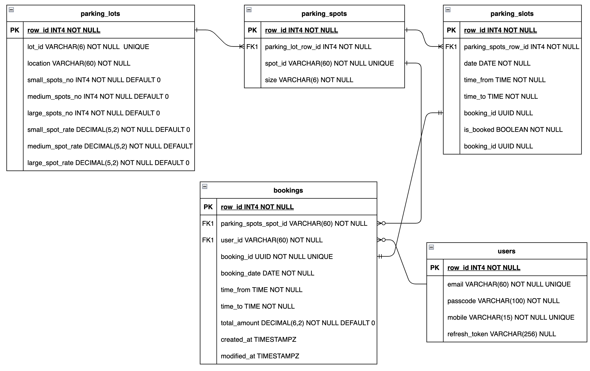

# Parking Lot App in Node JS
## The app uses Express, PostgreSQL and JWT based authentication

Parking Lot app supporting booking of parking slots for minimum 30 mins.

### Data Model



### API Details

* `/api/register`
    http POST on `/api/register` to register a user by providing email, password and mobile. email will be used as userid.
* `/api/auth/login`
    http POST on `/api/auth/login` to get an access token and a refresh token.
* `/api/auth/logout`
    http DELETE on `/api/auth/logout` to logout the user by removing the associated refresh token.
* `/api/auth/refresh_token` 
    http POST on `/api/auth/refresh_token` to get a new access token by passing the originaly returned refresh token at the time of log in. If a logout happens then this endpoint will not work and user will need to login again.


* `/api/parkinglots`
    * Supports http GET, POST. 
    * Additionally PUT, DELETE are supported by passing an ID `/api/parkinglots/:id`. ID field should be the human readable `lot_id` attribute of `parking_lots` entity.
    * Parking Spots are automatically generated/deleted whenever a parking lot is created/updated or deleted. Parking spots of each size are created based on the respective number attribute in each instance of parking lot.

 * `/api/parkingslots`
    * http GET is supported based on query parameters e.g. `/api/parkingslots?date=2021-12-28&lot_id=JY01&size=small&time_from=09:30&time_to=11:00`
    * http POST to create parking slots for a given parking spot and date. The slots will be created from 9:00AM to 20:00PM. Initially all the slots will be free. As and when a booking happens, the corresponding slot(s) will be marked as booked and corresponding `booking_id` will be updated.

 * `/api/bookings`
    * http GET is supported to search bookings by a user via query parameter e.g. `/api/bookings?user_id="TESTER"`.
    * http POST to create a booking by passing JSON payload
        ```json
        { 
            "date": "2021-12-28",
            "time_from": "09:30",
            "time_to": "10:00",
            "size": "small",
            "lot_id": "JY01"
        }
        ```       
     
A Login/Register page will be shown at the root url.
     